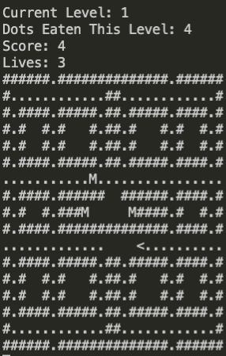

# PacManGame

My PacManGame is a console version of PacMan. This kata presented some really fun and interesting challenges and is still a WIP. I am refactoring large components and plan on restructuring and approcahing a few things differently - for instance I am intersted in reprsenting my grid differently.

This is what gameplay currently looks like




## Challenges and focuses

------


#### Building a cohesive core

A key concern throughout this project is building game logic core that isn't tied to a console implementation. This has been a focus in my refactoring  of my recent katas, for instance TicTacToe and Conways Game of Life. I pulled off any console specific implementation into a seperate console specific running component because I felt inspired to build a React front end for my Conways and this prompted me to remove console-specific bulk. 

The kata asks us to develop a console game, however I think this is an invaluable opportunity to try and think about things like decoupling and cohesiveness - and who knows you might want to build a front end, but even if you don't it's good to be good!

The game class curently hosts a number of functions that are tied up with console implementation and undermine my cohesive 'core'. Below are three functions that illustrate a problematic coupling to a console ipmlementation/ allowing console ipmlementation to bulk the main core class.  They come from the need to visualize the game and 'animate' it, but they needn't remain here.


```c#
    public void OscillatePacManMouthState() 
    {
      if (PacManCharacter.MouthOpen)
      {
        PacManCharacter.MouthOpen = false;
      }
      else if (!PacManCharacter.MouthOpen)
      {
        PacManCharacter.MouthOpen = true;
      }
    }

    public string GetPacManSymbol() 
    {
      switch (PacManCharacter.Heading)
      {
        case Direction.North:
          var northSymbol = PacManCharacter.MouthOpen ? ("V") : ("|");
          return northSymbol;

        case Direction.East:
          var eastSymbol = PacManCharacter.MouthOpen ? ("<") : ("-");
          return eastSymbol;

        case Direction.South:
          var southSymbol = PacManCharacter.MouthOpen ? ("^") : ("|");
          return southSymbol;

        case Direction.West:
          var westSymbol = PacManCharacter.MouthOpen ? (">") : ("-");
          return westSymbol;

        default:
          throw new System.ArgumentOutOfRangeException(nameof(PacManCharacter.Heading));
      }
    }


public String GetStateOfMapAsString() 
    {
      var printableGrid = new StringBuilder();

      for (int i = 0; i < _grid.RowCount; i++)
      {
        for (int j = 0; j < _grid.ColumnCount; j++)
        {
          var coordinate = new RowColumn(i, j);

          printableGrid.Append(_grid[coordinate].PrintableCell(GetPacManSymbol()));
        }
        printableGrid.Append("\n");
      }

      return printableGrid.ToString();
    }
```


#### Animating 

The options to 'animate' this game so it feels playable are limited by the form. My game renders a string grid, and so everything must move in the single tick() frame (as specified in the kata) and so that's where the 'animating' of pacmans mouth happens as seen in the functions above. I choose to add this feature last after I knew how my game was 'moving' and as such it was very simple to add on. I also gave this low priority as it is a feature I see is explicitely only relevant to a console implementation of this game.


#### OOP

